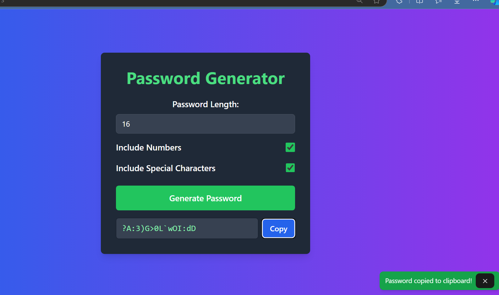

```markdown
# Password Generator 🔒

A sleek and customizable password generator built with React, Vite, and Tailwind CSS. Generate strong, secure passwords with optional settings for length, numbers, and special characters, ensuring the utmost security for your accounts.

## Features

- **Customizable Password Length**: Choose password lengths from 8 to 32 characters.
- **Include Numbers**: Toggle to add or remove numeric characters.
- **Include Special Characters**: Toggle to add or remove special characters.
- **Instant Copy**: Copy the generated password to the clipboard with a single click.

## Setup and Installation

### Prerequisites
- [Node.js](https://nodejs.org/) (v14 or above recommended)
- [npm](https://www.npmjs.com/) or [yarn](https://yarnpkg.com/)

### Installation

1. **Clone the Repository**
   ```bash
   git clone https://github.com/Mohitkumar49/password-generator.git
   cd password-generator
   ```

2. **Install Dependencies**
   ```bash
   npm install
   # or
   yarn install
   ```

3. **Run the App**
   ```bash
   npm run dev
   # or
   yarn dev
   ```

   The app will start on `http://localhost:3000` by default.

## Usage

1. **Set Password Options**:
   - **Length**: Use the slider to set the password length between 8 and 32 characters.
   - **Include Numbers**: Toggle to include numeric characters (`0-9`) for added strength.
   - **Include Special Characters**: Toggle to include special characters (e.g., `!@#$%^&*()_+`) to further enhance security.

2. **Generate Password**:
   - Click "Generate Password" to create a random password based on your selected options.
   
3. **Copy to Clipboard**:
   - Use the "Copy" button next to the generated password to copy it to your clipboard for quick and easy use.

## Code Structure

- **`App.jsx`**: Main component handling user inputs, password generation, and clipboard copying.
- **`Toast.jsx`**: A reusable component for displaying toast notifications, such as confirming when a password has been copied to the clipboard.
- **`tailwind.config.js`**: Tailwind configuration for custom styles.


## Technologies Used

- **React**: For building the user interface.
- **Vite**: For fast development and bundling.
- **Tailwind CSS**: For styling the application with utility-first classes.

## Contributing

Feel free to fork this repository and make pull requests. Contributions are welcome to add new features or improve existing functionality.

## License

This project is licensed under the MIT License - see the [LICENSE](LICENSE) file for details.

---

### Screenshot



---

### Author

Developed by [Mohit Kumar](https://github.com/Mohitkumar49)
```